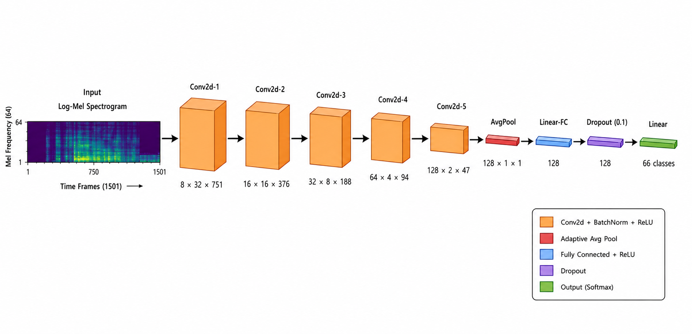
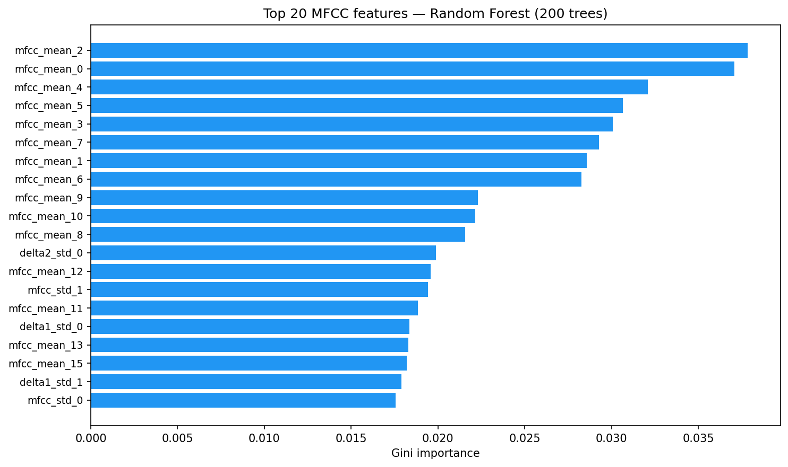

# Insect Species Classification Using MFCC and Log-Mel Features

This project investigates acoustic insect species classification on **InsectSet66**, a benchmark of 66 Orthoptera and Cicadidae species.
We conduct a comparative study between a deep learning CNN baseline and classical machine learning methods, comparing our results against those reported in [Faiß & Stowell (2023)](https://doi.org/10.1371/journal.pcbi.1011541).

> [!IMPORTANT]
> Preview the main project files below:
>
> | File | Description | Link |
> |------|-------------|------|
> | `baseline_replication.ipynb` | Replicated CNN baseline from the InsectSet66 paper | [](https://colab.research.google.com/github/4lirastegar/bioacoustic-species-classification/blob/main/baseline_replication.ipynb) |
> | `insect_classification.ipynb` | Our MFCC + SVM/RF/k-means experiments | [](https://colab.research.google.com/github/4lirastegar/bioacoustic-species-classification/blob/main/insect_classification.ipynb) |
> | `latex/` | IEEE-format research report (LaTeX source) | — |

## Installation and Usage

The project was developed using **Python 3.12** with a virtual environment. Deep learning models use **PyTorch**, classical classifiers use **scikit-learn**.

```bash
python3 -m venv .venv
source .venv/bin/activate
pip install torch torchaudio librosa scikit-learn soundfile pandas matplotlib seaborn jupyter ipykernel
```

Register the kernel for Jupyter:

```bash
python -m ipykernel install --user --name=thesis-audio --display-name "Python (thesis-audio)"
```

> [!NOTE]
> The dataset is **not included** in this repository (28 GB). Download it separately — see the Dataset section below.

## Dataset

**InsectSet66** — 2,887 mono WAV recordings from 66 insect species (Orthoptera and Cicadidae) with official train/validation/test splits.

[](https://zenodo.org/records/8252141)

Place the files at:

```text
data/
├── InsectSet66_Train_Val_Test_Annotation.csv
├── InsectSet66_Train_Val_Test/        ← .wav audio files
└── 66_species_order.csv               ← included in repo
```

## Methods

Three experiments are performed:

### 1. Log-Mel CNN (Baseline Replication)
A 5-layer convolutional network trained on log-mel spectrograms ($64 \times 1501$).
Each recording is split into 5-second chunks with 3.75 s overlap (64,290 chunks total).
Replicates the architecture from [Faiß & Stowell (2023)](https://doi.org/10.1371/journal.pcbi.1011541) **without** data augmentation.



### 2. MFCC + Classical Classifiers (SVM & Random Forest)
20 MFCCs + Δ + ΔΔ are extracted per chunk, collapsed to mean/std → **120-dimensional feature vector**.
- **SVM** (RBF kernel, C=10, balanced class weights)
- **Random Forest** (200 trees, balanced class weights)

### 3. Unsupervised Analysis (k-means + PCA)
K-means clustering (k=2 for visualization, k=66 for NMI) and PCA projection of the MFCC feature space to assess species separability without supervision.

## Results

| Model | Features | Val Acc | Val F1 | Test Acc | Test F1 |
|-------|----------|---------|--------|----------|---------|
| SVM (RBF) | MFCC | 0.744 | **0.633** | **0.767** | **0.711** |
| Random Forest | MFCC | **0.748** | 0.601 | 0.754 | 0.637 |
| Mel-CNN (replicated) | Log-mel | — | — | 0.604 | 0.514 |
| Mel-CNN ([Faiß & Stowell 2023](https://doi.org/10.1371/journal.pcbi.1011541)) | Log-mel + aug. | 0.81 | — | 0.82 | 0.74 |

SVM and RF on MFCC features outperform the unaugmented CNN replication.
The gap to the published 82% result is explained by the absence of data augmentation (colored noise + impulse responses).

K-means NMI (k=66) confirms that MFCC features encode substantial species-discriminative structure: **NMI = 0.58** (MFCC) and **0.587** (log-mel).

## Model Interpretability

Random Forest provides Gini feature importance, showing that **low-order MFCC means** (coefficients 0–7) are the most informative features for species discrimination.



## Report

The full IEEE-format research report is in `latex/`. Compile with:

```bash
cd latex
pdflatex report
bibtex report
pdflatex report
pdflatex report
```

## References

- Faiß M, Stowell D (2023). *Adaptive representations of sound for automatic insect recognition.* PLOS Computational Biology 19(10): e1011541. https://doi.org/10.1371/journal.pcbi.1011541
- InsectSet66 dataset: https://zenodo.org/records/8252141

## License

MIT License — see [LICENSE](LICENSE).
